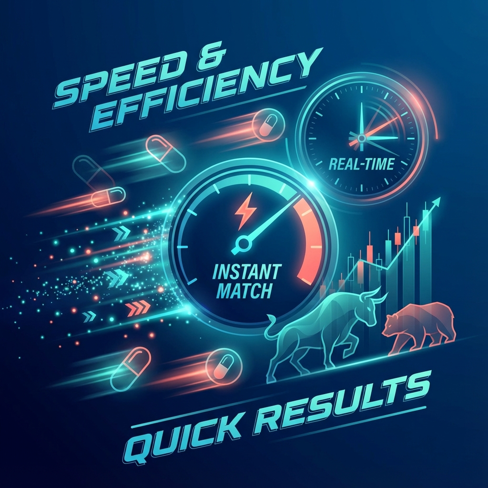
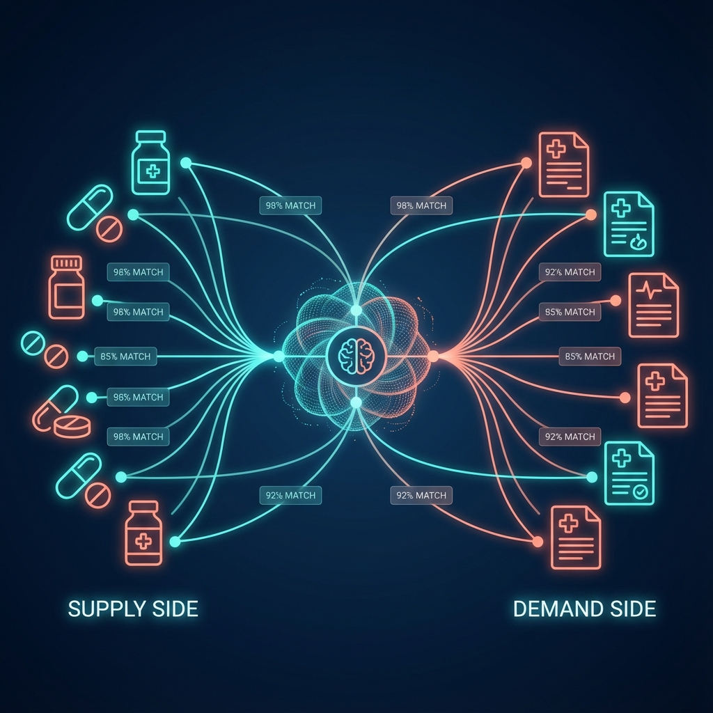
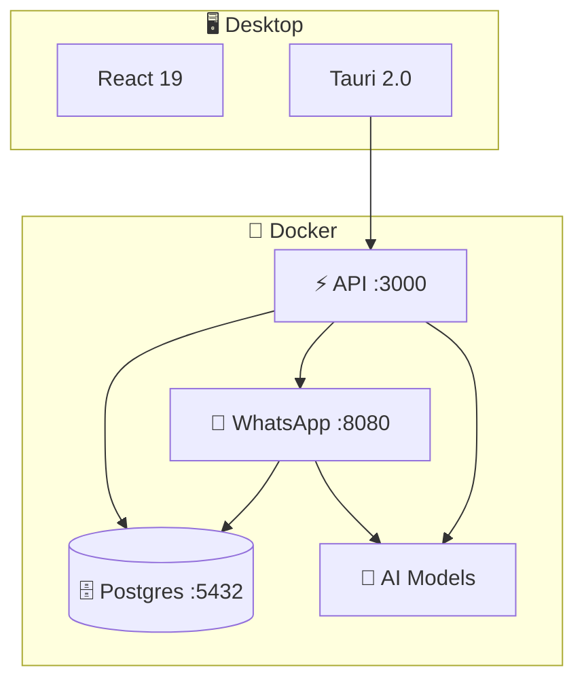

<div align="center">


# 🏥 PharmaBroker

**AI-Powered Pharmaceutical Trading Platform**

_Bridging medication supply and demand through intelligent automation_

[](https://www.typescriptlang.org/)
[](https://go.dev/)
[](https://tauri.app/)
[](https://bun.sh/)
[](https://www.docker.com/)

[Quick Start](#-quick-start) •
[Features](#-features) •
[Architecture](#-architecture) •
[Commands](#-commands) •
[Docs](#-documentation)

</div>

---

<div align="center">

</div>

---

## ✨ Features

<table>
<tr>
<td width="60%">

| Category        | Technologies                         |
| :-------------- | :----------------------------------- |
| 🖥️ **Desktop**  | Tauri 2.0, React 19, TanStack Router |
| ⚡ **Backend**  | Hono, oRPC (type-safe APIs)          |
| 🗄️ **Database** | PostgreSQL 18 + pgvector, Prisma     |
| 📱 **WhatsApp** | Go/Gin microservice                  |
| 🤖 **AI**       | Docker Model Runner                  |
| 🔧 **DevOps**   | Turborepo, Docker Compose, Taskfile  |

</td>
<td width="40%" align="center">

</td>
</tr>
</table>

---

## 🧠 Intelligent Matching

<div align="center">


_Real-time AI matching of medication supply with patient demand_

</div>

---

## 🏗️ Architecture



---

## 🚀 Quick Start

### Prerequisites

| Tool                          | Version |
| :---------------------------- | :------ |
| [Bun](https://bun.sh)         | v1.2+   |
| [Docker](https://docker.com)  | v2.38+  |
| [Rust](https://rust-lang.org) | Latest  |
| [Task](https://taskfile.dev)  | Latest  |

### Setup

```bash
# 1. Install dependencies
bun install
cp .env.example .env

# 2. Start backend services
task dev:docker:full

# 3. Initialize database
task db:push

# 4. Launch desktop app
task tauri:dev
```

> 💡 See [QUICKSTART.md](QUICKSTART.md) for detailed instructions

---

## 🎯 Commands

| Category        | Command                | Description                |
| :-------------- | :--------------------- | :------------------------- |
| 🐳 **Docker**   | `task dev:docker:full` | Start all backend services |
| 🖥️ **Desktop**  | `task tauri:dev`       | Launch Tauri app           |
| 🗄️ **Database** | `task db:push`         | Push schema to database    |
| 🗄️ **Database** | `task db:studio`       | Open Prisma Studio         |
| 📋 **Infra**    | `task infra:logs`      | View Docker logs           |
| 📋 **Infra**    | `task infra:down`      | Stop Docker services       |
| 🤖 **AI**       | `task ai:pull`         | Pull AI models             |

> Run `task --list` to see all available commands

---

## 📁 Project Structure

```
pharmabroker/
├── 📂 apps/
│   ├── web/              # React + Tauri desktop
│   └── server/           # Hono API (Bun)
├── 📂 packages/
│   ├── api/              # oRPC router
│   ├── auth/             # Better Auth
│   ├── db/               # Prisma schema
│   └── env/              # Environment validation
└── 📂 service/
    └── whatsapp/         # Go/Gin microservice
```

---

## 📚 Documentation

| Document                          | Description              |
| :-------------------------------- | :----------------------- |
| 📖 [QUICKSTART.md](QUICKSTART.md) | Step-by-step setup guide |
| 🐳 [DOCKER.md](DOCKER.md)         | Docker configuration     |

---

## 🔧 Tech Stack

<div align="center">

|                                                                                                              |                                                                                                    |                                                                                                  |                                                                                                    |                                                                                                              |                                                                                                      |                                                                                              |
| :----------------------------------------------------------------------------------------------------------: | :------------------------------------------------------------------------------------------------: | :----------------------------------------------------------------------------------------------: | :------------------------------------------------------------------------------------------------: | :----------------------------------------------------------------------------------------------------------: | :--------------------------------------------------------------------------------------------------: | :------------------------------------------------------------------------------------------: |
|  |  |  |  |  |  |  |
|                                                  TypeScript                                                  |                                              React 19                                              |                                               Rust                                               |                                               Tauri                                                |                                                  PostgreSQL                                                  |                                                Docker                                                |                                              Go                                              |

</div>

---

<div align="center">

**MIT © PharmaBroker**

</div>
